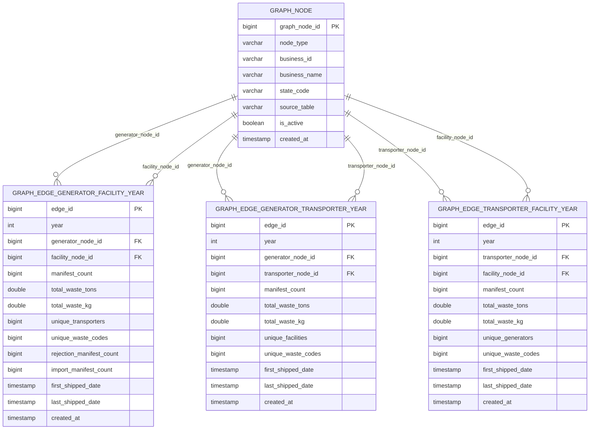

```mermaid
erDiagram

    GRAPH_NODE {
        bigint graph_node_id PK
        varchar node_type
        varchar business_id
        varchar business_name
        varchar state_code
        varchar source_table
        boolean is_active
        timestamp created_at
    }

    GRAPH_EDGE_GENERATOR_FACILITY_YEAR {
        bigint edge_id PK
        int year
        bigint generator_node_id FK
        bigint facility_node_id FK
        bigint manifest_count
        double total_waste_tons
        double total_waste_kg
        bigint unique_transporters
        bigint unique_waste_codes
        bigint rejection_manifest_count
        bigint import_manifest_count
        timestamp first_shipped_date
        timestamp last_shipped_date
        timestamp created_at
    }

    GRAPH_EDGE_GENERATOR_TRANSPORTER_YEAR {
        bigint edge_id PK
        int year
        bigint generator_node_id FK
        bigint transporter_node_id FK
        bigint manifest_count
        double total_waste_tons
        double total_waste_kg
        bigint unique_facilities
        bigint unique_waste_codes
        timestamp first_shipped_date
        timestamp last_shipped_date
        timestamp created_at
    }

    GRAPH_EDGE_TRANSPORTER_FACILITY_YEAR {
        bigint edge_id PK
        int year
        bigint transporter_node_id FK
        bigint facility_node_id FK
        bigint manifest_count
        double total_waste_tons
        double total_waste_kg
        bigint unique_generators
        bigint unique_waste_codes
        timestamp first_shipped_date
        timestamp last_shipped_date
        timestamp created_at
    }

    GRAPH_NODE ||--o{ GRAPH_EDGE_GENERATOR_FACILITY_YEAR : "generator_node_id"
    GRAPH_NODE ||--o{ GRAPH_EDGE_GENERATOR_FACILITY_YEAR : "facility_node_id"

    GRAPH_NODE ||--o{ GRAPH_EDGE_GENERATOR_TRANSPORTER_YEAR : "generator_node_id"
    GRAPH_NODE ||--o{ GRAPH_EDGE_GENERATOR_TRANSPORTER_YEAR : "transporter_node_id"

    GRAPH_NODE ||--o{ GRAPH_EDGE_TRANSPORTER_FACILITY_YEAR : "transporter_node_id"
    GRAPH_NODE ||--o{ GRAPH_EDGE_TRANSPORTER_FACILITY_YEAR : "facility_node_id"
```
