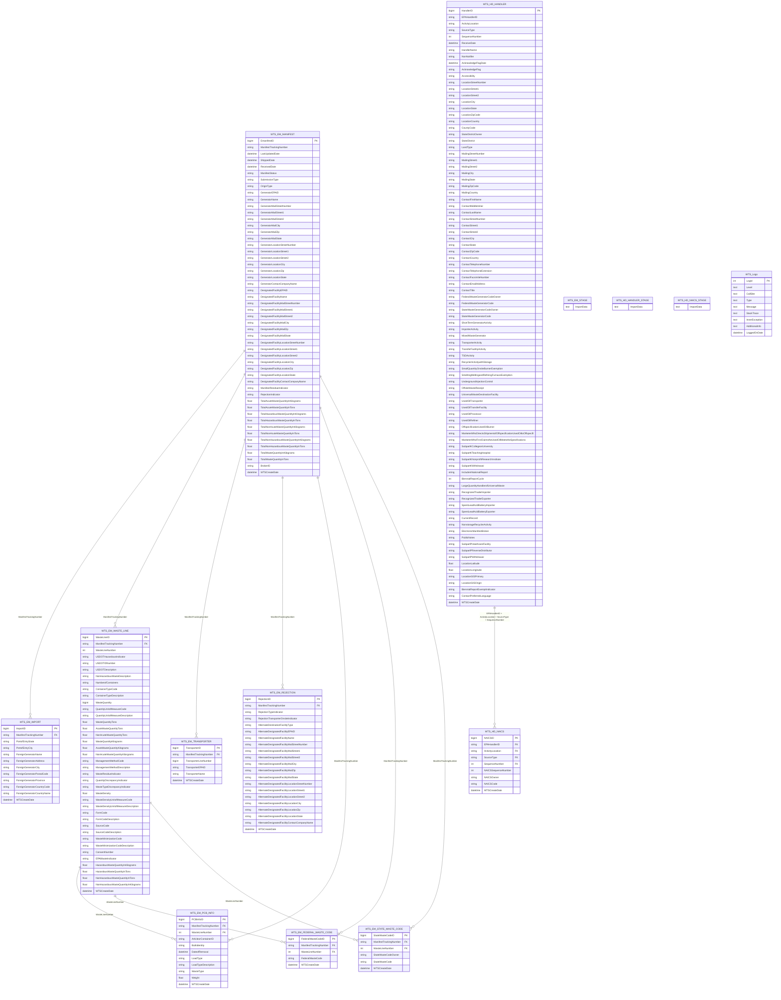

```mermaid
erDiagram

  WTS_EM_MANIFEST {
    bigint EmanifestID PK
    string ManifestTrackingNumber
    datetime LastUpdatedDate
    datetime ShippedDate
    datetime ReceivedDate
    string ManifestStatus
    string SubmissionType
    string OriginType
    string GeneratorEPAID
    string GeneratorName
    string GeneratorMailStreetNumber
    string GeneratorMailStreet1
    string GeneratorMailStreet2
    string GeneratorMailCity
    string GeneratorMailZip
    string GeneratorMailState
    string GeneratorLocationStreetNumber
    string GeneratorLocationStreet1
    string GeneratorLocationStreet2
    string GeneratorLocationCity
    string GeneratorLocationZip
    string GeneratorLocationState
    string GeneratorContactCompanyName
    string DesignatedFacilityEPAID
    string DesignatedFacilityName
    string DesignatedFacilityMailStreetNumber
    string DesignatedFacilityMailStreet1
    string DesignatedFacilityMailStreet2
    string DesignatedFacilityMailCity
    string DesignatedFacilityMailZip
    string DesignatedFacilityMailState
    string DesignatedFacilityLocationStreetNumber
    string DesignatedFacilityLocationStreet1
    string DesignatedFacilityLocationStreet2
    string DesignatedFacilityLocationCity
    string DesignatedFacilityLocationZip
    string DesignatedFacilityLocationState
    string DesignatedFacilityContactCompanyName
    string ManifestResidueIndicator
    string RejectionIndicator
    float TotalAcuteWasteQuantityInKilograms
    float TotalAcuteWasteQuantityInTons
    float TotalHazardousWasteQuantityInKilograms
    float TotalHazardousWasteQuantityInTons
    float TotalNonAcuteWasteQuantityInKilograms
    float TotalNonAcuteWasteQuantityInTons
    float TotalNonHazardousWasteQuantityInKilograms
    float TotalNonHazardousWasteQuantityInTons
    float TotalWasteQuantityInKilograms
    float TotalWasteQuantityInTons
    string BrokerID
    datetime WTSCreateDate
  }

  WTS_EM_IMPORT {
    bigint ImportID PK
    string ManifestTrackingNumber FK
    string PortofEntryState
    string PortofEntryCity
    string ForeignGeneratorName
    string ForeignGeneratorAddress
    string ForeignGeneratorCity
    string ForeignGeneratorPostalCode
    string ForeignGeneratorProvince
    string ForeignGeneratorCountryCode
    string ForeignGeneratorCountryName
    datetime WTSCreateDate
  }

  WTS_EM_WASTE_LINE {
    bigint WasteLineID PK
    string ManifestTrackingNumber FK
    int WasteLineNumber
    string USDOTHazardousIndicator
    string USDOTIDNumber
    string USDOTDescription
    string NonHazardousWasteDescription
    string NumberofContainers
    string ContainerTypeCode
    string ContainerTypeDescription
    bigint WasteQuantity
    string QuantityUnitofMeasureCode
    string QuantityUnitofMeasureDescription
    float WasteQuantityTons
    float AcuteWasteQuantityTons
    float NonAcuteWasteQuantityTons
    float WasteQuantityKilograms
    float AcuteWasteQuantityKilograms
    float NonAcuteWasteQuantityKilorgrams
    string ManagementMethodCode
    string ManagementMethodDescription
    string WasteResidueIndicator
    string QuantityDiscrepancyIndicator
    string WasteTypeDiscrepancyIndicator
    float WasteDensity
    string WasteDensityUnitofMeasureCode
    string WasteDensityUnitofMeasureDescription
    string FormCode
    string FormCodeDescription
    string SourceCode
    string SourceCodeDescription
    string WasteMinimizationCode
    string WasteMinimizationCodeDescription
    string ConsentNumber
    string EPAWasteIndicator
    float HazardousWasteQuantityInKilograms
    float HazardousWasteQuantityInTons
    float NonHazardousWasteQuantityInTons
    float NonHazardousWasteQuantityInKilograms
    datetime WTSCreateDate
  }

  WTS_EM_TRANSPORTER {
    bigint TransporterID PK
    string ManifestTrackingNumber FK
    bigint TransporterLineNumber
    string TransporterEPAID
    string TransporterName
    datetime WTSCreateDate
  }

  WTS_EM_REJECTION {
    bigint RejectionID PK
    string ManifestTrackingNumber FK
    string RejectionTypeIndicator
    string RejectionTransporterOnsiteIndicator
    string AlternateDestinationFacilityType
    string AlternateDesignatedFacilityEPAID
    string AlternateDesignatedFacilityName
    string AlternateDesignatedFacilityMailStreetNumber
    string AlternateDesignatedFacilityMailStreet1
    string AlternateDesignatedFacilityMailStreet2
    string AlternateDesignatedFacilityMailCity
    string AlternateDesignatedFacilityMailZip
    string AlternateDesignatedFacilityMailState
    string AlternateDesignatedFacilityLocationStreetNumber
    string AlternateDesignatedFacilityLocationStreet1
    string AlternateDesignatedFacilityLocationStreet2
    string AlternateDesignatedFacilityLocationCity
    string AlternateDesignatedFacilityLocationZip
    string AlternateDesignatedFacilityLocationState
    string AlternateDesignatedFacilityContactCompanyName
    datetime WTSCreateDate
  }

  WTS_EM_PCB_INFO {
    bigint PCBInfoID PK
    string ManifestTrackingNumber FK
    int WasteLineNumber FK
    string ArticleorContainerID
    string BulkIdentity
    datetime DateofRemoval
    string LoadType
    string LoadTypeDescription
    string WasteType
    float Weight
    datetime WTSCreateDate
  }

  WTS_EM_FEDERAL_WASTE_CODE {
    bigint FederalWasteCodeID PK
    string ManifestTrackingNumber FK
    int WasteLineNumber FK
    string FederalWasteCode
    datetime WTSCreateDate
  }

  WTS_EM_STATE_WASTE_CODE {
    bigint StateWasteCodeID PK
    string ManifestTrackingNumber FK
    int WasteLineNumber FK
    string StateWasteCodeOwner
    string StateWasteCode
    datetime WTSCreateDate
  }

  WTS_HD_HANDLER {
    bigint HandlerID PK
    string EPAHandlerID
    string ActivityLocation
    string SourceType
    int SequenceNumber
    datetime ReceiveDate
    string HandlerName
    string NonNotifier
    datetime AcknowledgeFlagDate
    string AcknowledgeFlag
    string Accessibility
    string LocationStreetNumber
    string LocationStreet1
    string LocationStreet2
    string LocationCity
    string LocationState
    string LocationZipCode
    string LocationCountry
    string CountyCode
    string StateDistrictOwner
    string StateDistrict
    string LandType
    string MailingStreetNumber
    string MailingStreet1
    string MailingStreet2
    string MailingCity
    string MailingState
    string MailingZipCode
    string MailingCountry
    string ContactFirstName
    string ContactMiddleInitial
    string ContactLastName
    string ContactStreetNumber
    string ContactStreet1
    string ContactStreet2
    string ContactCity
    string ContactState
    string ContactZipCode
    string ContactCountry
    string ContactTelephoneNumber
    string ContactTelephoneExtension
    string ContactFacsimileNumber
    string ContactEmailAddress
    string ContactTitle
    string FederalWasteGeneratorCodeOwner
    string FederalWasteGeneratorCode
    string StateWasteGeneratorCodeOwner
    string StateWasteGeneratorCode
    string ShortTermGeneratorActivity
    string ImporterActivity
    string MixedWasteGenerator
    string TransporterActivity
    string TransferFacilityActivity
    string TSDActivity
    string RecyclerActivitywithStorage
    string SmallQuantityOnsiteBurnerExemption
    string SmeltingMeltingandRefiningFurnaceExemption
    string UndergroundInjectionControl
    string OffsiteWasteReceipt
    string UniversalWasteDestinationFacility
    string UsedOilTransporter
    string UsedOilTransferFacility
    string UsedOilProcessor
    string UsedOilRefiner
    string OffspecificationUsedOilBurner
    string MarketerWhoDirectsShipmentofOffspecificationUsedOiltoOffspecifi
    string MarketerWhoFirstClaimstheUsedOilMeetstheSpecifications
    string SubpartKCollegeorUniversity
    string SubpartKTeachingHospital
    string SubpartKNonprofitResearchInstitute
    string SubpartKWithdrawal
    string IncludeinNationalReport
    int BiennialReportCycle
    string LargeQuantityHandlerofUniversalWaste
    string RecognizedTraderImporter
    string RecognizedTraderExporter
    string SpentLeadAcidBatteryImporter
    string SpentLeadAcidBatteryExporter
    string CurrentRecord
    string NonstorageRecyclerActivity
    string ElectronicManifestBroker
    string PublicNotes
    string SubpartPHeathcareFacility
    string SubpartPReverseDistributor
    string SubpartPWithdrawal
    float LocationLatitude
    float LocationLongitude
    string LocationGISPrimary
    string LocationGISOrigin
    string BiennialReportExemptIndicator
    string ContactPreferredLanguage
    datetime WTSCreateDate
  }

  WTS_HD_NAICS {
    bigint NAICSID PK
    string EPAHandlerID FK
    string ActivityLocation FK
    string SourceType FK
    int SequenceNumber FK
    int NAICSSequenceNumber
    string NAICSOwner
    string NAICSCode
    datetime WTSCreateDate
  }

  WTS_EM_STAGE {
    text ImportData
  }

  WTS_HD_HANDLER_STAGE {
    text ImportData
  }

  WTS_HD_NAICS_STAGE {
    text ImportData
  }

  WTS_Logs {
    int LogId PK
    text Level
    text CallSite
    text Type
    text Message
    text StackTrace
    text InnerException
    text AdditionalInfo
    datetime LoggedOnDate
  }

  %% Relationships inferred from matching field names
  WTS_EM_MANIFEST ||--o{ WTS_EM_IMPORT : "ManifestTrackingNumber"
  WTS_EM_MANIFEST ||--o{ WTS_EM_WASTE_LINE : "ManifestTrackingNumber"
  WTS_EM_MANIFEST ||--o{ WTS_EM_TRANSPORTER : "ManifestTrackingNumber"
  WTS_EM_MANIFEST ||--o{ WTS_EM_REJECTION : "ManifestTrackingNumber"
  WTS_EM_MANIFEST ||--o{ WTS_EM_PCB_INFO : "ManifestTrackingNumber"
  WTS_EM_MANIFEST ||--o{ WTS_EM_FEDERAL_WASTE_CODE : "ManifestTrackingNumber"
  WTS_EM_MANIFEST ||--o{ WTS_EM_STATE_WASTE_CODE : "ManifestTrackingNumber"

  %% Waste-line-level children (match on WasteLineNumber; typically also paired with ManifestTrackingNumber)
  WTS_EM_WASTE_LINE ||--o{ WTS_EM_PCB_INFO : "WasteLineNumber"
  WTS_EM_WASTE_LINE ||--o{ WTS_EM_FEDERAL_WASTE_CODE : "WasteLineNumber"
  WTS_EM_WASTE_LINE ||--o{ WTS_EM_STATE_WASTE_CODE : "WasteLineNumber"

  %% Handler/NAICS (match on shared natural-key fields)
  WTS_HD_HANDLER ||--o{ WTS_HD_NAICS : "EPAHandlerID + ActivityLocation + SourceType + SequenceNumber"
```
